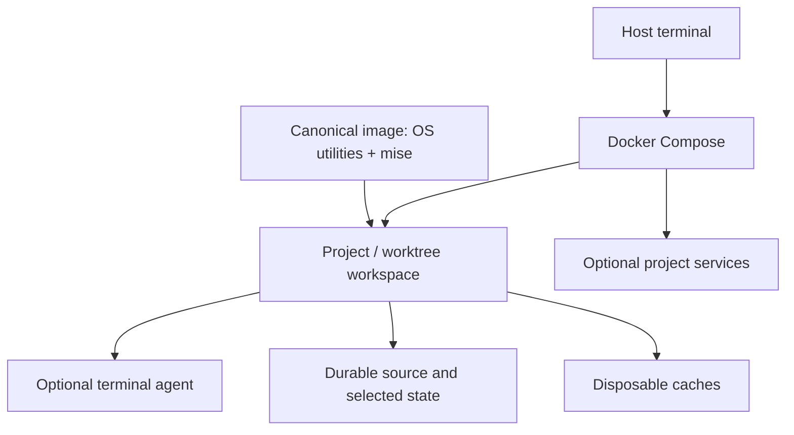

# Proposed architecture

[Project overview](../README.md) · [Acceptance roadmap](roadmap.md)

**Status: design intentions only; no implementation or platform validation.** Hestia targets reproducible terminal development on Apple Silicon macOS and Windows through WSL2. Simplicity, recoverable work, and narrowly scoped host access take priority over preinstalled features.

## Layers and responsibilities

Layers describe responsibilities, not separate image families. Keep one canonical image/build definition and build route for supported architectures and optional capabilities; its file layout is undecided.

| Layer | Responsibility |
| --- | --- |
| Host boundary | Provide a terminal and a Docker/Compose-capable runtime. Expose only the selected repository, required Git metadata, and explicitly chosen state or access. Runtime choice is open. |
| Minimal base | Supply OS utilities and mise. Keep project language runtimes, agents, and project services out of the default base. Verify dependency artifacts against upstream checksums or signatures appropriate to each architecture. |
| Project workspace | Give each project a stable identity across recreation and distinguish its worktrees. Use mise for repository-declared toolchains; keep repository build/test behavior authoritative. |
| Optional agent | Install only a selected agent, such as Codex CLI, omp, or pi.dev. Use its own authentication, sessions, and permission controls; do not introduce a Hestia agent supervisor or replacement policy layer. |
| Project services | Compose only the services the project needs. Scope service names, networking, ports, and data to the project rather than creating a mandatory shared stack. |

## Workspace and storage boundaries

A linked Git worktree can refer to Git metadata outside its checkout. The workspace design must make both its worktree metadata and shared Git directory reachable at consistent paths, without solving this by exposing a whole host home directory. Identity must distinguish unrelated projects and sibling worktrees; its naming and mapping scheme remains open.

| Data class | Intended lifecycle |
| --- | --- |
| Source and Git metadata | Durable outside the container writable layer, including staged, unstaged, and untracked work, the shared Git directory, and linked-worktree metadata. |
| Selected state | Explicitly persisted configuration, agent session data, and project service data where needed. Persist only the chosen scope, not a broad host home or credential tree. |
| Caches and temporary output | Disposable package downloads and reproducible build output. Losing these may require rebuilding but must not lose unique work or required state. |

Classify data by recoverability, not directory name: tools may mix sessions, credentials, and caches in one location. Credentials stay outside source and image build contexts, with any runtime access deliberately scoped. Container recreation must preserve durable data; deleting its storage or losing the host requires backup/restore, not merely persistence. The storage backend and backup mechanism are undecided.

## Compact decision records

These record architectural intentions, not completed implementation decisions.

| Context | Decision | Consequence / trade-off |
| --- | --- | --- |
| Multiple build routes can drift. | One canonical image/build path; OS utilities plus mise form the minimal base. | Easier to reason about than parallel image families; optional installation still needs a design that does not fork the build path. |
| Project runtimes differ; hosts need architecture-appropriate artifacts. | Use mise-managed project toolchains and verified dependencies through the same multi-architecture build definition. | Avoid a universal preinstalled toolchain; artifact availability, pinning, and update verification must be established before claiming reproducibility or support. |
| Recreation must not destroy work. | Separate durable source/state from disposable caches, with explicit project/worktree identity. | Requires deliberate mount and ownership choices; persistence alone is not a backup or an isolation guarantee. |
| Agents and services are project choices. | Install agents optionally, retain their native session/permission mechanisms, and compose services as needed. | Avoid a new orchestration framework; different agents may need different narrowly scoped state and authentication arrangements. |
| Host access increases exposure. | No default host Docker socket mount or broad credential/home-directory mounts. | Some workflows will need explicit, reviewed access; a container alone is not a complete security boundary. |

Browser IDE and voice input remain optional future capabilities, outside the initial proof. They must not become dependencies of the terminal workflow.

## Unresolved decisions

- Which real repository and terminal agent will demonstrate the first milestone? What are that repository's actual build and test steps?
- Which base distribution, minimal OS utilities, and mise bootstrap method? How will versions, upstream integrity evidence, and updates be recorded and verified? No dependencies or version pins are selected here.
- Where will the canonical build and Compose definitions live? How will optional agents be installed without creating competing build paths?
- How will project/worktree identities map to paths, service names, and storage? How will shared Git metadata remain accessible without unnecessarily exposing sibling source trees?
- Which data uses bind mounts versus managed volumes? How will ownership, permissions, macOS filesystem behavior, and WSL2 source placement be handled? Which agent/service state must persist?
- How will narrowly scoped agent authentication work? What belongs in a backup, how are sensitive state and credentials handled, and how will restoration be verified?
- Which host runtimes and CPU architectures form the tested matrix? Apple Silicon requires an ARM64 path; the Windows/WSL2 matrix, including AMD64 coverage, remains to be validated. Native availability versus emulation is not assumed.

Resolve choices against the next milestone's evidence, not a speculative feature backlog.

## Reference basis

Read-only inspiration comes from `container-dev-env`: its `docs/decisions/005-container-image-architecture.md` describes layered functionality; its root `Dockerfile` selects architecture-specific artifacts and checks their SHA-256 hashes; its `docs/architecture/volume-architecture.md` separates source, persistent state, and caches. These are paths in the reference repository, not Hestia files or runtime dependencies.

Retain those principles, not its multiple image entry points, feature backlog, agent orchestration framework, extensive specification machinery, or unverified performance and persistence claims.
