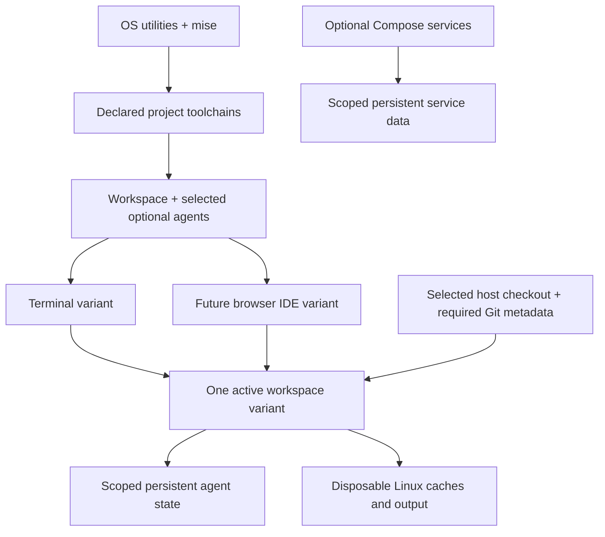

# Architecture decisions

[Overview](../README.md) · [Milestone 1](milestone-1.md) · [Roadmap](roadmap.md)

**Status:** design accepted 2026-09-09; implementation pending. Targets: Apple Silicon macOS and Windows/WSL2. Argus's work-laptop platform is unconfirmed.

## Shared foundation

The future IDE variant shares the terminal variant's toolchain/agent stages and runs its terminal in that environment. Compose profiles select services, not image packages. GUI and voice remain future capabilities.

## ADR-001: Host source and explicit persistence

**Status: Accepted.** Host tools need access to source while containers remain disposable.

**Decision:** bind-mount only the selected checkout and required Git metadata. Preserve resolved host paths inside the container. Discover metadata through Git; validate both absolute and relative worktree links, including the common Git directory. Do not rewrite Git pointers on startup or expose the whole host home/repository collection.

| Data | Placement and lifecycle |
| --- | --- |
| Source, index, untracked work, Git/worktree metadata | Existing host storage; never deleted by Hestia lifecycle operations |
| Selected agent configuration, sessions, credentials | Explicit persistent location per workspace and agent, outside source/build context |
| Database and other service data | Workspace-scoped persistent volumes by default; shared data requires an explicit choice |
| Linux dependencies and reproducible output | Workspace-scoped disposable Docker volumes, separate from native host artifacts |
| Temporary files | Disposable container storage |

Classify data by recoverability: agents can mix credentials, sessions, and caches in one directory. Define artifact paths or overlays per project so native and Linux outputs do not overwrite each other. Installed image tools live outside persisted state mounts so old state cannot hide updates.

**Consequences:** host and container edits affect the same source, including deletions. Coordinate writes to one checkout; independent agents should use separate worktrees. Worktrees share Git metadata and are not mutually untrusted security boundaries. Measure bind-mount performance before changing storage; prefer WSL Linux filesystem source placement on Windows. Source in managed volumes is an alternative with extra friction for host tools.

Ownership handling must reflect the runtime: host and container UIDs need not match. Validate effective write access and never recursively chown host source as a repair. Persistence protects against container removal, not disk loss or storage deletion.

## ADR-002: Checkout identity and resource scope

**Status: Accepted design.** Matching repository names and sibling worktrees must not collide.

**Decision:** repository identity groups checkouts by canonical common Git directory; workspace identity uses the canonical checkout path. Derive a Compose project name using a sanitized, length-bounded label and deterministic path hash: `hestia-<label>-<hash>`. Document and test the exact encoding/truncation during implementation. Check the full recorded path before reusing existing state to detect collisions.

Use this identity consistently for containers, networks, caches, and agent/service state. Let Compose namespace resources; avoid fixed container names and globally named volumes. Branch, tool, agent, or future IDE variant changes preserve identity. Different checkout paths receive different identities. Do not use remote URLs or branch names as identity. Handle host-port conflicts separately; resource naming does not namespace host ports.

**Consequences:** moving a checkout changes identity; preserve old state for explicit, validated reattachment. IDs are local, not shared team identifiers. Names alone collide; random IDs require registration/recovery machinery. No registry or automatic move tracking is required.

## ADR-003: Build-time tools and optional interfaces

**Status: Accepted design.** Optional functionality must share a foundation rather than develop competing installation paths.

**Decision:** use one Dockerfile/build route with reusable stages or named targets. The base contains OS utilities and mise; project layers install declared tools and selected optional agents. Record versions and appropriate upstream verification evidence per architecture. Application dependency lockfiles remain authoritative; mise lock guarantees vary by backend and must be checked.

Normal startup installs or upgrades no tools. Declaration changes require an explicit build/update. Keep trusted build manifests separate from arbitrary project code; mounting a repository does not automatically authorize its hooks, tasks, or mise configuration. Preserve native trust controls. Never include credentials or agent login state in build contexts.

Run one workspace variant per checkout by default. A future IDE variant adds an IDE to the same project/agent environment, retaining source and persistent state when switching variants. Independent project services remain separate Compose services.

**Consequences:** builds need downloads; warm startup is predictable. Shared declarations do not prove byte-for-byte reproducibility. No universal toolchain image or mandatory service stack is required.

## ADR-004: Native authentication and scoped agent state

**Status: Accepted.** Preserve sessions with scoped credentials and native agent controls.

**Decision:** run the selected agent directly with its native login, permission, trust, and session mechanisms. Persist only required state per workspace and agent. Inspect supported paths and credential-refresh behavior before choosing concrete mounts. Do not share one writable agent home between concurrent workspaces by default.

Keep Git authentication separate: use a scoped credential helper or supported SSH-agent forwarding where practical, not a broad SSH-directory mount. Supply API keys at runtime; prefer service-scoped secret files where supported. If a tool requires environment variables, document that limitation without claiming they are hidden from container inspection. Credential values must not enter generated Compose files, tracked manifests, build arguments, logs, or evidence reports.

**Consequences:** some workspaces need separate login. Deliberate credential sharing can follow a demonstrated need. Agents can access credentials supplied to them; containerization adds no separate protection against that authorized access. Logout/revocation must preserve source and unrelated sessions. Back up useful state; prefer reauthentication on restore. If required state mixes credentials with sessions, treat its backup as sensitive and encrypt it. Full backup/restore follows the pilot.

## ADR-005: Lifecycle preserves work

**Status: Accepted design.** Runtime cleanup must be independent of user-data deletion.

| Operation | Contract |
| --- | --- |
| Start | Validate config, paths, identity and access; create/start the selected workspace |
| Attach | Open another terminal in the existing workspace |
| Stop | Stop processes; retain runtime resources and persistent data |
| Remove container | Remove runtime resources; preserve source, state and persistent volumes |
| Rebuild | Explicitly rebuild/recreate; preserve durable data |
| Clear caches | Delete only identified disposable caches for the selected workspace |
| Delete workspace state | Separate destructive action that previews and confirms precisely named resources |

These are behavior names, not implemented commands. Begin with Compose and small helpers for demonstrated gaps. Rebuild may interrupt processes; finish active work first. Failures must be actionable and must not mutate source as a repair. Routine operations never perform global prune, implicit volume deletion, or source deletion. Destructive state-deletion automation may remain deferred in Milestone 1.

Tests use unique disposable identities and synthetic storage, never production resources. Cache clearing must leave source/Git and selected durable state unchanged.

## Remaining implementation choices

- User/work laptop: OS/CPU, available runtime, first agent, Argus build/tests/services. Argus remains employer-local.
- Foundation: distribution, package list, verified mise/tool versions, canonical file layout, identity encoding, mount/ownership strategy and fixture toolchain.
- Agent integration: credential/state paths, login transport/refresh and session resumption evidence.
- Later: backup mechanism and broader Windows/WSL2 matrix. No support/performance claims are established here.

## Primary references

- [Docker bind mounts](https://docs.docker.com/engine/storage/bind-mounts/) and [filesystem performance](https://code.visualstudio.com/remote/advancedcontainers/improve-performance)
- [Git worktree metadata](https://git-scm.com/docs/git-worktree)
- [Compose project names](https://docs.docker.com/compose/how-tos/project-name/), [profiles](https://docs.docker.com/compose/how-tos/profiles/) and [secrets](https://docs.docker.com/compose/how-tos/use-secrets/)
- [Multi-stage builds](https://docs.docker.com/build/building/multi-stage/) and [mise lock limits](https://mise.jdx.dev/dev-tools/mise-lock.html)

`container-dev-env` is read-only reference; its backlog and agent framework are not inherited.
